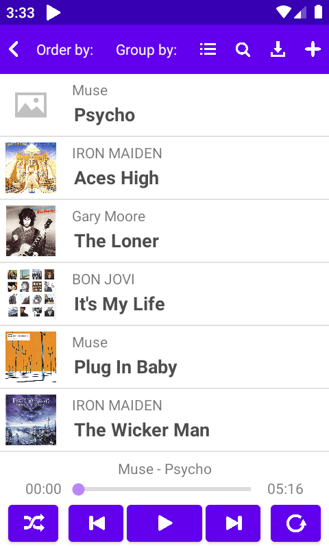
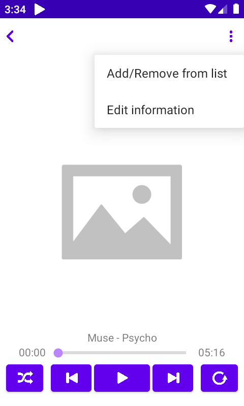
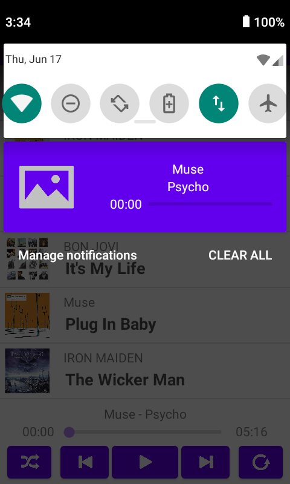

# Proxecto fin de ciclo

## Descrición

O proxecto consiste nun reprodutor de música en Android. A aplicación permite ao usuario:

- Reproducir cancións que teña no seu dispositivo, nas carpetas que se especifiquen.
- Reproducir as cancións en orde aleatorio e en bucle.
- Ordear as cancións por título, artista, álbum e data.
- Mostrar as cancións agrupadas por artista, álbum e data.
- Crear e manexar listas de reproducción.
- Buscar cancións mediante un buscador.
- Descargar cancións para reproducilas.
- Editar a información das cancións.

En canto ao funcionamento, a aplicación gardará a información máis relevante de cada canción nunha base de datos no momento no que o usuario selecciona unha carpeta con cancións.

Esta información será: Título, Artista, Álbum, Data, Duración, Imaxe e Ruta.

A información usarase según sexa necesario na aplicación. Os artistas, álbums e imaxes das cancións que non se poidan ler gardaranse na base de datos como “Desconocido”.

## Instalación / Posta en marcha

Para instalar a aplicación, usar o .apk nun dispositivo Android.

## Uso

A aplicación consta con duas pantallas: unha pantalla principal e unha pantalla de reprodutor. 

- A pantalla principal está dividida en 3 partes: un menú superior, unha lista de cancións e un reprodutor.
1. No menú superior temos dous menús de selección que permiten ordear ou agrupar cancións e 5 botóns que permiten, neste orde, volver a    lista de cancións anterior, mostrar e administrar as listas existentes, buscar cancións, descargar cancións e añadir cancións que se encontren no almacenamento do dispositivo.
2. A lista de cancións, ademais de visualizar as cancións, permite reproducilas ao clicalas.
3. O reprodutor permite reproducir, pausar, moverse a canción anterior ou posterior da lista, reproducir cancións en bucle e reproducir cancións nunha orde aleatoria. Ademais ten unha barra de desprazamento que permite adiantar ou atrasar a canción ao tempo desexado.

  

- A pantalla de reprodutor conta con dous botóns na parte superior, a portada da canción que se está reproducindo e un reprodutor.
1. O botón de arriba a esquerda permite volver a pantalla principal. O botón de arriba a dereita abre un menú de selección que permite engadir ou quitar a canción actual dunha lista ou editar a información da canción.
2. O reprodutor segue o mesmo funcionamento que o da pantalla principal.

  

- A aplicación lanza ademais unha notificacion coa información da canción que se está a reproducir. Ao premer nesta notificación, ábrese a aplicación.

  

## Índice

1. Anteproxecto
    * 1.1. [Idea](doc/anteproxecto/Idea.md)
    * 1.2. [Necesidades](doc/anteproxecto/Necesidades.md)
2. [Análise](doc/analise/Analise.md)
3. [Deseño](doc/deseño)
4. [Implantación](Proxecto_JulioSB)
